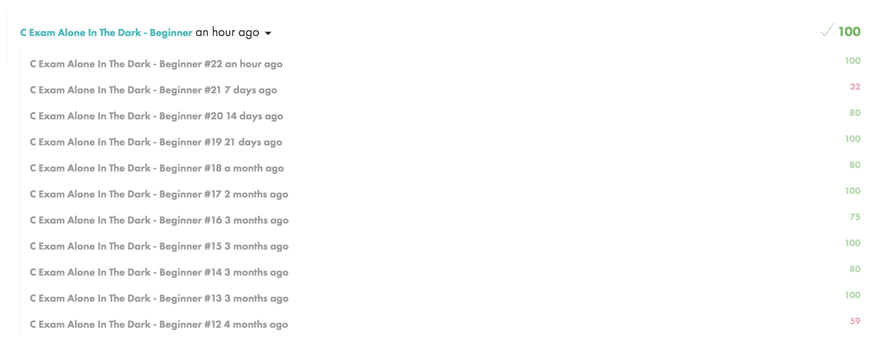
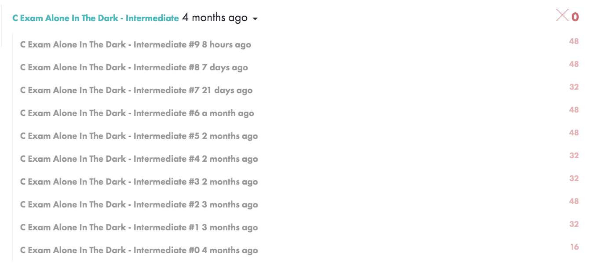

# Alone In The Dark
## A collection of C Exam Exercises

These are the exercises that I have faced so far in the "C Exam Alone In The Dark", beginner and intermediate levels, of 42 School. These exams allow usme to check our achievements when we were alone in front of the computer, without peers and without internet. To validate "Beginners" level (which is a prerequisite for "Intermediate"), we must validate 5 exams with a minimum score of 75, which  means be able to succed on exercises of level 4. To validate "Intermediate" level, we must validate 5 exams with a minimum score of 85.

## Beginner record:

## Intermediate record:

## Key points:

* Pointers and adress arithmetic.
* Multi-dimensional arrays vs pointer to pointers (pointers array).
* Command-line arguments.
* Pointers to functions.
* Structure manipulation.

## Objectives:

* Basics of C.
* Algorithmic Knowledge.

## Skills:

* Imperative programming.
* Rigor.
* Algorithms & AI.

## Installation:

(All exercises in this collection include a main, even those that are not required by the subject for the purpose of the exam. Some lines may need to be uncommented).

`gcc -Wall -Wextra -Werror "file_exercise"` | Compiles and creates the `a.out` file.

## Execution:

`./a.out` | For exercises that doesn't expects command-line arguments.

`./a.out [argument string 1] [argument string 2] [argument string 3]` | For exercises that expects command-line arguments.

## Credits:

[*Luis Sanchez*](https://www.linkedin.com/in/luis-sanchez-13bb3b189/)
2019. Freemont, CA
